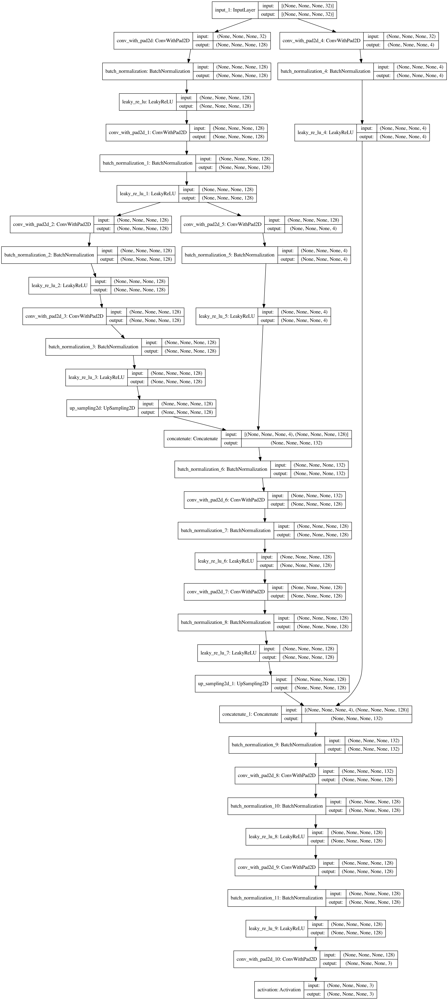
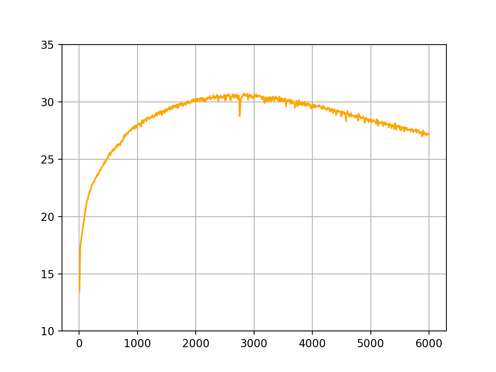
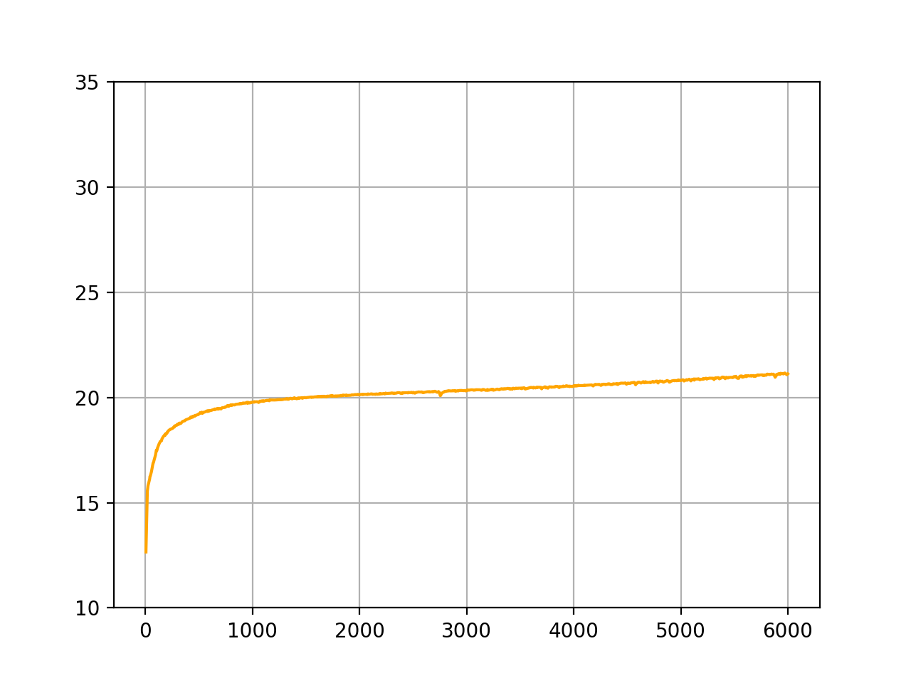
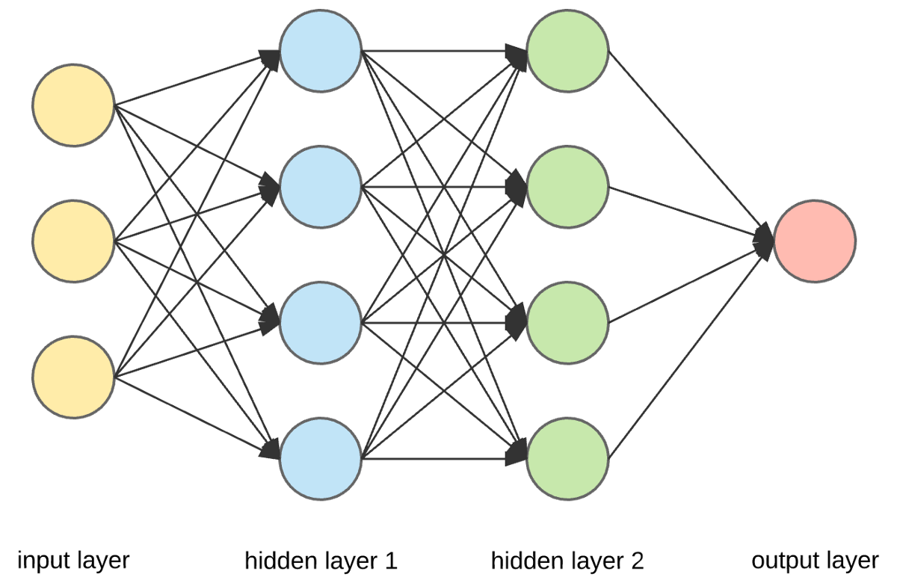

```{r setup, include=F}
knitr::opts_chunk$set(echo = FALSE)
knitr::opts_chunk$set(warning = FALSE)
knitr::opts_chunk$set(message = FALSE)
knitr::opts_chunk$set(fig.align = "center")
```

# Introduction

Le [Réseau neuronal convolutif] (en anglais ***CNN***) est actuellement l'une des techniques les plus connues dans les problèmes de reconstruction d'image inverse. Ils se sont avérés efficace dans un grand nombre de tâches, y compris le débruitage d'image, la super-résolution d'image et la reconstruction d'images. Elle est un type de réseau de neurones artificiels acycliques (feed-forward), dans lequel le motif de connexion entre les neurones est inspiré par le cortex visuel des animaux.

La puissance de cette architecture est attribuée à sa capacité d'apprendre à partir de nombreux grands ensembles d'images. Cependant, [@2007.02471; @1711.10925] et de nombreux autres travaux ont démontré que l'architecture d'un CNN peut agir comme un préalable suffisamment fort pour résoudre [des problèmes inverses][Les problèmes inverses] comme la reconstruction d'image, même sans étape d'apprentissage. Plus précisément, les réseaux non entrans fonctionnent bien pour le débruitage d'image [@2007.02471], l'acquisition comprimée [@1806.06438] et même pour la reconstruction de vidéos [@1910.01684].

Dans ce travail, nous nous concentrerons sur la technique ***Deep Image Prior***. Dans la partie suivante, nous allons examiner quelques exemples. En suite, nous approfondissons le principe sous-jacent de celui-ci à travers l'exemple précédent. Enfin, nous expérimenterons ce que nous venons de présenter ci-dessus et ferons quelques études complémentaires.

Tout d'abord, nous clarifierons certaines terminologies.

\newpage

<!--## Réseau neuronal convolutif

Un réseau neuronal est l’association, en un graphe plus ou moins complexe, d’objets élémentaires, les neurones formels. Les principaux réseaux se distinguent par l’organisation du graphe (en couches, complets, $etc,$), c’est-à-dire leur architecture, son niveau de complexité (le nombre de neurones, présence ou non de boucles de rétroaction dans le réseau) par le type des neurones (leurs fonctions de transition ou d’activation) et enfin par l’objectif visé: apprentissage supervisé ou non, optimisation, systèmes dynamiques, $etc.$

Le neurone formel est un modèle qui se caractérise par un état interne $s$ , des signaux d’entrée $x_{1}$, \dots,  $x_{p}$ et une fonction d’activation
$$ s=h(x_{1},\dots,x_{p})=g(\alpha_{0} + \sum_{j=1}^{p} \alpha_{j}x_{j}) = g(\alpha_{0} + \alpha' x)$$

La fonction d’activation opère une transformation d’une combinaison affine des signaux d’entrée, $\alpha_{0}$, terme constant, étant appelé le biais du neurone. Cette combinaison affine est déterminée par un vecteur de poids $[\alpha_{0},\dots,\alpha_{p}]$ associé à chaque neurone et dont les valeurs sont estimées dans la phase d’apprentissage. Ils constituent la mémoire ou connaissance répartie du réseau.

Un réseau de neurones convolutifs ou réseau de neurones à convolution est un type de réseau de neurones artificiels, dont architecture est formée par un empilement de couches (les combinaisons des neurones formels) de traitement:

- La couche de convolution (CONV)
- La couche de pooling (POOL)
- La couche d'activation
- La couche "entièrement connectée" (FC)
- La couche de perte (LOSS)

## Les problèmes inverses
Les problèmes inverses peuvent être formulés comme la tâche d’optimisation avec la formule: 
$$x^* = min_{x}E(x;x_{0}) + R(x)$$

Le réseau neuronal convolutionnel va décoder et générer une fonction de type: 
$$x = f_{\theta}(z)$$ 
qui correspond bien aux données. La fonction va lier un vecteur qui est donné au hasard avec une image X. La méthode est sélectionnée spécifiquement pour chaque application.!-->

# Les aspects techniques
Dans cette partie, un résumé des différents aspects techniques est une introduction. Cela nous aidera à établir une connexion entre les mathématiques et l'informatique plus facilement et fournira également des informations supplémentaires sur "Deep Image Prior".

## Le code
Tout d'abord, nous entrons dans le code. Comme indiqué ci-dessus, nous avons essayé de réécrire le code dans [@1711.10925]. Étant donné que chaque problème nécessite un modèle différent, nous nous concentrons uniquement sur le modèle de débruitage (bien que notre code devrait fonctionner avec la plupart des modèles de cet article).

Outre la motivation de mieux comprendre le code, il y a quelques raisons techniques à nos motivations pour un réimplémentation:

- Le code est obsolète (il a été écrit pour la première fois en 2017).
- Mélange entre Pytorch Sequential et Module API, ce qui rend le code difficile à suivre (en particulier la fonction de création de modèle).
- Modèle irritant par boucle brute, ce qui rend plus difficile l'intégration avec des API et des outils modernes (par exemple TensorBoard).

Nous le réécrivons à l'aide de TensorFlow, et nous ajoutons également des métriques supplémentaires pour mesurer le PSNR entre l'image débruitée et l'image bruité et le PSNR entre l'image débruitée et l'image originale.

## Le modèle
```{r denoising-model, fig.cap="Exemple de modèle de débruitage", out.height="90%"}

```

Ici, nous voyons une architecture CNN (\@ref(fig:denoising-model)) très typique. Bien que le modèle dans [@1711.10925] soit plus profond et ait beaucoup plus de couches, il a toujours le même groupe de couches qu'un auto-encodeur ([décodage et encodage]) avec sauts de connexions.

L'entrée du modèle est un tenseur de forme `[batch_size, image_height, image_width, 32]` où `batch_size` vaut 1 dans notre cas. 32 est le nombre de canaux (caractéristiques) qui seront expliqués plus tard. Sa sortie est un tenseur avec une forme de `[batch_size, image_height, image_width, 3]` qui pourrait être affiché comme une image (3 canaux car nous avons une image RGB (Red-Green-Blue)).

## Décodage et encodage

```{r compare-with-edge, fig.cap="La détection de bord", fig.show="hold", out.width="50%", fig.subcap=c("original", "bord")}
knitr::include_graphics("../res/edge/lena.png")
knitr::include_graphics("../res/edge/lena_edge.png")
```

Le décodage est un processus d'extraction de caractéristiques d'une image. Sur le côté opposé, l'encodeur collectera les caractéristiques des décodeurs et reconstruira l'image. Les caractéristiques peuvent être n'importe quoi, varient des bords (\@ref(fig:compare-with-edge)), de la couleur à la résolution.

Dans notre cas, le nombre de 32 de la [section précédente][Le modèle] signifie que nous capturons 32 caractéristiques différentes à partir d'une image bruité pour reconstruire l'image d'origine. Cela explique pourquoi si nous répétons le processus trop souvent, l'image de sortie tendra vers l'image bruité. Parce qu'à une certaine étape, les décodeurs considéreront le bruit comme une caractéristique et le captureront.

Sous le capot, le décodeur est construit à partir d'opérations convolutives. En parcourant chaque pixel et en appliquant le noyau convolutif, nous pourrions extraire les fonctionnalités souhaitées. L'illustration d'une opération convolutive en image peut être vue comme suit:
$$\left(\begin{bmatrix}
  0 & 0 & 0 & 0 & 0\\
  0 & a & b & c & 0\\
  0 & d & e & f & 0\\
  0 & g & h & j & 0\\
  0 & 0 & 0 & 0 & 0\\
\end{bmatrix}
\begin{bmatrix}
  1 & 1\\
  1 & 1\\
\end{bmatrix}\right) =
\begin{bmatrix}
  a & a+b & b+c & c\\
  a+d & a+b+d+e & b+c+e+f & c+f\\
  d+g & d+e+g+h & e+f+h+j & f+j\\
  g & g+h & h+j & j\\
\end{bmatrix}
$$

## La sortie

Pour bien comprendre, nous avons bouclé le processus 6000 fois.

Voici notre image de test:
```{r noisy-original-image, fig.cap="L'image originale et l'image bruité", fig.show="hold", out.width="25%", fig.subcap=c("original", "bruyant")}
knitr::include_graphics("../res/denoising/input.png")

```

Et le résultat que nous obtenons:
```{r model-epoch-output, fig.cap="La sortie de l'epoch", fig.show="hold", out.width="25%", fig.subcap=c("1", "1000", "3000", "6000")}


```

Nous pouvions voir clairement les différences entre chaque epoche. Cela pourrait s'expliquer comme suit:

- A la première époque, l'entrée est un bruit aléatoire et le modèle est initialisé avec des poids aléatoires. Nous voyons donc une image aléatoire, qui n'est pas liée à la sortie souhaitée.
- Vers la 1000e époque, les décodeurs à l'intérieur du modèle commencent à s'ajuster pour extraire les caractéristiques de l'image bruité. Premièrement, ils extraient les plus importants comme le bord, la couleur, la résolution, $etc.$
- A la 3000ème époque, les décodeurs et encodeurs sont désormais capables d'extraire toutes les caractéristiques souhaitées et de reconstruire une image de sortie comme on le voit dans \@ref(fig:model-epoch-output).
- Plus nous bouclons le processus, plus il y a de parties extraites et des caractéristiques indésirables comme le bruit sont également incluses. Par conséquent, nous voyons une image assez proche de l'image bruyante (\@ref(fig:noisy-original-image)).

Pour une vue plus scientifique, ce sont les métriques que nous avons utilisées lors de l'itération de ce modèle:
```{r model-psnr, fig.cap="Le PSNR entre l'image débruitée et l'image", fig.show="hold", out.width="50%", fig.subcap=c("originale", "bruité")}


```

D'après la figure \@ref(fig:model-psnr), il y a une tendance croissante dans le PSNR entre l'image débruitée et l'image bruyante. D'autre part, le PSNR entre celui-ci et l'image d'origine atteint son apogée vers 3000 epoches et commence à diminuer par la suite. Cela correspond à ce que nous avons vu auparavant en comparant différentes sorties avec nos yeux.

C'est la fin des aspects techniques. Dans la partie suivante, nous approfondirons les principes mathématiques sous-jacents, en particulier pourquoi cette méthode fonctionne ?

\newpage

# Mathématiques et Deep Learning

Tout d'abord, nous clarifierons certaines terminologies.

## Les problèmes inverses
Les problèmes inverses peuvent être formulés comme la tâche d’optimisation avec la formule:
$$x^* = min_{x}E(x;x_{0}) + R(x)$$

Le réseau neuronal convolutionnel va décoder et générer une fonction de type:
$$x = f_{\theta}(z)$$
qui correspond bien aux données. La fonction va lier un vecteur qui est donné au hasard avec une image $x$.
La méthode est sélectionnée spécifiquement pour chaque application.

## Réseaux profonds

Les réseaux profonds sont des modèles paramétriques qui effectuent des opérations séquentielles sur leurs données d'entrée. Chacune de ces opérations, communément appelée «couche», consiste en une transformation linéaire, disons, une convolution de son entrée, suivie d'une «fonction d'activation» non linéaire ponctuelle, par exemple, un sigmoïde. Les réseaux profonds ont récemment conduit à des améliorations spectaculaires des performances de classification dans diverses applications de traitement de la parole et du langage naturel et de la vision par ordinateur. La propriété cruciale des réseaux profonds que l'on pense être la racine de leurs performances est qu'ils ont un grand nombre de couches par rapport aux réseaux de neurones classiques; mais il existe d'autres modifications architecturales telles que les acti vations linéaires rectifiées (ReLUs)  et les connexions «raccourcies» résiduelles. D'autres facteurs majeurs de leur succès sont la disponibilité d'ensembles de données massifs, par exemple des millions d'images dans des ensembles de données comme ImageNet, et du matériel informatique GPU efficace pour résoudre le problème d'optimisation de haute dimension qui en résulte, qui peut avoir jusqu'à 100 millions de paramètres. Le succès empirique de l'apprentissage profond, en particulier des réseaux de neurones convolutionnels (CNN) pour les tâches basées sur l'image, présente de nombreuses énigmes aux théoriciens. En particulier, il existe trois facteurs clés dans l'apprentissage profond, à savoir les architectures, les techniques de régularisation et les algorithmes d'optimisation, qui sont essentiels pour former des réseaux profonds performants et comprendre leur nécessité et leur interaction est essentiel si nous voulons percer les secrets de leur succès

## Réseau neuronal convolutif

### Definition

Un réseau neuronal est l’association d’objets élémentaires, les neurones formels, interconnectés permettant la résolution de problèmes complexes tels que la reconnaissance des formes ou le traitement du langage naturel,
grâce à l'ajustement des coefficients de pondération dans une phase  d'apprentissage. Le réseau éxecute quelques opération avec les données. Pour chaque opération, familièrement appelée **couche**, consiste une transformation linéaire des données avec une fonction d'activation.

```{r cnn-model, fig.cap="Illustration d'un réseau neuronal convolutif"}

```

Le premier modèle mathématique et informatique du neurone biologique est proposé par Warren McCulloch et Walter Pitts. Dans le modèle de McCulloch et Pitts, à chaque entrée est associé une valeur numérique appelé le poids synaptique.
Donc, nous pouvons écrire le neurone formel comme un modèle qui se caractérise par
un état interne $s$ , des signaux d’entrée $x_{1}$, \dots,  $x_{p}$ avec les poids synaptique associé
$\alpha_{1}$, \dots,  $\alpha_{p}$ et une fonction d’activation
$$ s=h(x_{1},\dots,x_{p})=\phi(\alpha_{0} + \sum_{j=1}^{p} \alpha_{j}x_{j}) = \phi(\alpha_{0} + \alpha' x)$$

Les principaux réseaux se distinguent par l’organisation du graphe (en couches, complets, $etc,$), c’est-à-dire leur architecture, son niveau de complexité (le nombre de neurones, présence ou non de boucles de rétroaction dans le réseau) par le type des neurones (leurs fonctions de transition ou d’activation) et enfin par l’objectif visé: apprentissage supervisé ou non, optimisation, systèmes dynamiques, $etc.$

La fonction d’activation opère une transformation d’une combinaison affine
des signaux d’entrée, $\alpha_{0}$, terme constant, étant appelé le biais du neurone.
Cette combinaison affine est déterminée par un vecteur de poids $[\alpha_{0},\dots,\alpha_{p}]$ associé à chaque neurone et dont les valeurs sont estimées dans la phase d’apprentissage.
Ils constituent la mémoire ou connaissance répartie du réseau.

Un réseau de neurones convolutifs ou réseau de neurones à convolution
est un type de réseau de neurones artificiels, dont architecture est formée par
un empilement de couches (les combinaisons des neurones formels) de traitement:

- La couche de convolution (CONV)
- La couche de pooling (POOL)
- La couche d'activation
- La couche "entièrement connectée" (FC)
- La couche de perte (LOSS)

### Principes mathématiques

Soit $x \in R^{N \cdot D}$ un point de données tel que chaque colonne de $x$ est un $D$-dimensions point de données et $N$ le nombre de exemples à entrainer. Soit $W^k \in R^{d_{k-1} \cdot d_k}$ la matrice representant une transformation linéaire de la sortie de **couche** $k-1$ (soit $x_{k-1} \in R ^{Nd_{k-1}}$) pour obtenir une $d_k$-dimension $x_{k-1}W_{k} \in R^{N \cdot d_{k}}$

Soit $\xi(x)$ une fonction d'activation non-linéaire (par exemple: une fonction sigmoïde $\xi(x) = (1+e^{-x})^{-1}$, un ReLU $\xi(x) = \max{0,x}$). Donc, la sortie $x_k$ sera:
$$\phi (x, W^1, \dots, W^K)=\xi_K(\xi_{K-1}(\dots \xi_1(xW^1)\dots W^{K-1})W^K)$$

## Optimisation globale

Nous cherchons à aborder le problème d'apprendre les paramètres d'un réseau neuronal. Soit $(X,Y) $N$ exemples à entrainer. Sur le réglage de classification, chaque ligne de $X \in R^{N \cdot D} dénote un point de données dans $R^D$ et chaque ligne de $Y \in \{1,0\}^{N\cdot C} dénote la cotisation de chaque point de données. Donc, nous cherchons à optimiser le problème d'apprendre le réseaux:
$$\min_{{W^k}_{k=1}^K} l(Y,\phi(X,W^1,\dots,W^K))+\lambda \xi(W^1,\dots,W^K)$$ avec $l$ est la fonction de perte qui donne la conformité entre la sortie et le résultat prévu, $\xi$ la fonction de régularisation désigné à éviter le surapprentissage et $\lambda$ équilibre paramètres.

\newpage

# Deep Image Prior

## Principes

La technique ***Deep Image Prior*** a fait une percée dans la dans le contexte
de problèmes inverses mal posés. Le réseau est connu pour le reconstruction d'image sans étape d'apprentissage. Nous allons étudier les Principes dedans et comment cette technique fonctionne.

Normalement, le ***Deep learning*** aborde un problème par deux étapes. Premièrement, c'est l'étape d'apprentissage.
Dans cette étape, le paramètre de réseau est optimisé par minimiser un approprié fonction de perte à partir de
un grande ensemble de données. Puis, les nouvelles données est traité dans le réseau pour résoudre le problème.
Néanmoins, la technique ***Deep Image Prior*** est basé seulement sur une seul point de données $y^\gamma$. C'est-à-dire
la technique est d'entrainer un réseau avec son paramètre par minimiser la fonction de perte: $$\min_{\xi} \mid\mid A\varphi_\xi(z) - y^\gamma \mid\mid^2$$.

Le resultat sur le réseau de ***Deep Prior*** utilise le feed-forward architecture qui commence par:
\begin{center} $x^0 = z$    et    $x^{k+1} = \phi (W_k x^k + b_k)$ for $k = 0,...,L-1$  \end{center}
Donc, les résultats obtenues sont $$\varphi_\xi(z) = x^L$$ avec les paramètres $\xi = \{W_0,...,W_{L-1},b_0,...,b_{L-1}\}$.
Pour la technique ***Deep Image Prior***, il n'y a pas d'étape d'apprentissage. Donc, $\xi$ n'est pas fixé.
La solution pour le problème inverse sera $$x=\varphi_\xi(z)$$ avec z fixé. La technique vise à paramétriser la solution avec $\xi$.

## Méthode appliquée

Dans ce projet, nous cherchons à comprendre le fonctionnement de cette technique
en utilisant le prieur implicitement capturé par le choix d’une structure de réseau de générateurs particulière.
Nous avons mis un paramétrage $$x = f_\theta(z)$$ avec $x$ est un image de $R^{3xHeightxWidth}$ (une image colorée de taille
Height x Width pixels a chaque pixel un combinaison de 3 couleurs rouge, vert et bleu).
Ici, $\theta$ sont des paramètres du réseau.

Suite le travail, nous essayons d'aborder le problème de reconstruire une image $x$ d'une image endommagée $x_0$ suite une tâche de minimiser: $$\min_{x} E(x;x_0) + R(x)$$ où $E(x;x_0)$ est une fonction dépendant des données et $R(x)$ est une régularisation. Dans ce travail, nous essayons de prendre la régularisation $R(x)$ comme le prieur capturé par le réseau convolutif. L'idée est de prendre une approprié application surjective $$g: \theta \mapsto x$$ pour avoir: $$\min_{g(\theta)} E(g(\theta);x_0) + R(g(\theta))$$ pour éliminer le terme $R(x)$. Enfin, nous avons la formule: $$\min_{\theta} E(f_{\theta}(z);x_0)$$ avec $f_{\theta}$ est initialisé au hazard. 

En utilisant un méthode d'optimisation (par exemple : descente de gradient), nous cherchons à minimiser le terme $\theta \rightarrow \theta^*$ :
\begin {center} $\theta ^* = argmin_{\theta} E(f_{\theta}(z);x)$ et $x^* = f_{\theta^*}(z)$ \end {center}

## Application sur le débruitage et reconstruction d'image

Le but du débruitage est de reconstruire une image $x$ d'une image bruité $x_0$. Le modèle dégradé est parfois connu sur la forme : $x_0 = x + \epsilon$. En prenant $$ E(x;x_{0})= \mid\mid x - x_{0} \mid\mid^2 $$ nous avons un problème d'optimisation: $$ E(f_{\theta}(z);x_{0})= \mid\mid f_{\theta(z)} - x_{0} \mid\mid^2 $$

\newpage
